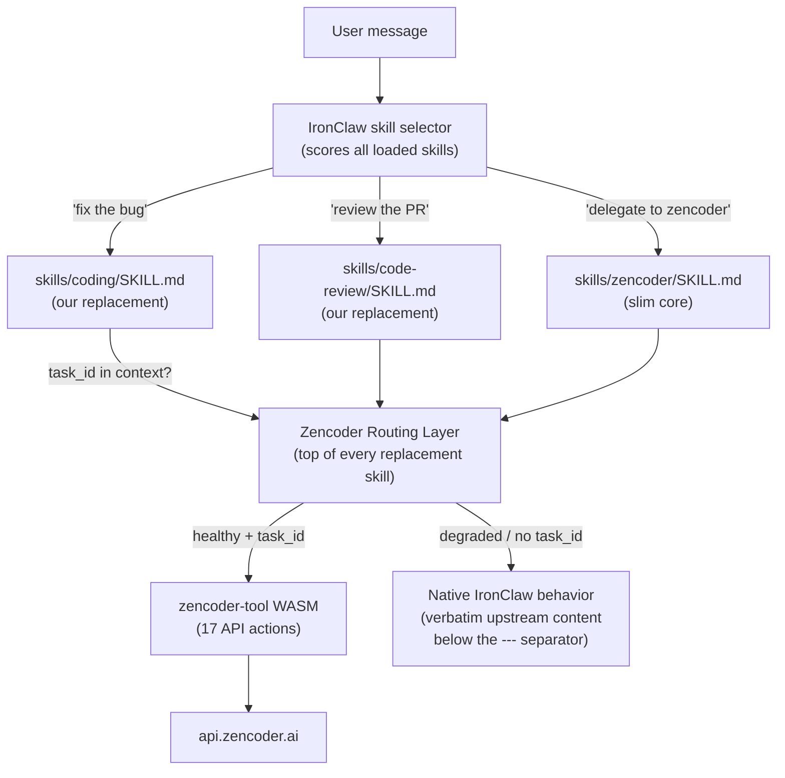

# Zencoder × IronClaw Integration

A complete integration between **IronClaw** (the NEAR AI agent runtime) and **Zencoder/Zenflow** (the AI-powered coding platform). This repository ships two components that work together:

1. **`zencoder-tool`** — a WASM extension that gives IronClaw agents access to 17 Zencoder API actions (delegate coding tasks, manage projects, track plans, configure automations).
2. **Skill overrides** — six `SKILL.md` files that replace IronClaw's bundled native skills with Zencoder-aware versions, so every coding/review/plan/commit/delegation turn automatically considers Zencoder routing — without requiring the user to say "Zencoder".

---

## Table of Contents

- [Why This Exists](#why-this-exists)
- [Architecture Overview](#architecture-overview)
- [What Each Skill Does](#what-each-skill-does)
- [Prerequisites](#prerequisites)
- [Part 1 — Build and Install the WASM Tool](#part-1--build-and-install-the-wasm-tool)
  - [Step 1 — Install system dependencies](#step-1--install-system-dependencies)
  - [Step 2 — Install Rust](#step-2--install-rust)
  - [Step 3 — Add the WASM target](#step-3--add-the-wasm-target)
  - [Step 4 — Install IronClaw](#step-4--install-ironclaw)
  - [Step 5 — Clone this repository](#step-5--clone-this-repository)
  - [Step 6 — Build the WASM binary](#step-6--build-the-wasm-binary)
  - [Step 7 — Register the tool with IronClaw](#step-7--register-the-tool-with-ironclaw)
  - [Step 8 — Authenticate with Zencoder](#step-8--authenticate-with-zencoder)
  - [Step 9 — Verify the tool is working](#step-9--verify-the-tool-is-working)
- [Part 2 — Install the Skill Overrides](#part-2--install-the-skill-overrides)
  - [What are skill overrides?](#what-are-skill-overrides)
  - [Option A — Workspace install (recommended)](#option-a--workspace-install-recommended)
  - [Option B — User-global install](#option-b--user-global-install)
  - [Verify the skills loaded](#verify-the-skills-loaded)
- [Using the Integration](#using-the-integration)
  - [Natural language examples](#natural-language-examples)
  - [Raw JSON payloads (advanced)](#raw-json-payloads-advanced)
- [Upgrading](#upgrading)
- [Rotating Your Access Token](#rotating-your-access-token)
- [Development](#development)
- [Security Model](#security-model)
- [Troubleshooting](#troubleshooting)
- [Project Structure](#project-structure)
- [License](#license)

---

## Why This Exists

IronClaw activates one or more **skills** per message based on keyword/pattern scoring. Without this integration, a message like *"fix the bug"* activates IronClaw's bundled `coding` skill — which tries to edit files locally and has zero knowledge of Zencoder. If you have a Zenflow agent already working on the task, the agent and IronClaw will race to edit the same codebase.

This integration solves three problems:

| Problem | Solution |
|---|---|
| IronClaw ignores Zencoder on generic coding turns | Replace the `coding` skill with a Zencoder-aware version that checks `task_id` context first |
| The Zencoder monolith costs ~3,500 tokens on every explicit "zencoder" turn | Split into a slim ~1,000-token core + routing logic embedded in each replacement skill |
| No guard against local commits while a remote agent owns the branch | The `commit` replacement blocks local commits when a Zencoder task is `inprogress`/`inreview` |

---

## Architecture Overview



**Discovery order** (IronClaw uses the first file it finds with a given `name:`):

1. `<workspace>/skills/` — our files live here (workspace mode) or in `~/.ironclaw/skills/` (global)
2. `~/.ironclaw/skills/`
3. `~/.ironclaw/installed_skills/`
4. Bundled into the IronClaw binary

Because workspace files win, our replacements silently override the bundled skills — no patching required.

---

## What Each Skill Does

| File | Overrides | Token budget | What the routing layer adds |
|---|---|---|---|
| `skills/coding/SKILL.md` | bundled `coding` v1.0.0 | 1,500 | If `task_id` is in context → call `check_solution_status` before editing locally. If user explicitly delegates → call `solve_coding_problem`. |
| `skills/code-review/SKILL.md` | bundled `code-review` v2.0.0 | 2,500 | If `task_id` in scope → attach findings via `update_task` (calls `get_task` first to avoid clobbering existing description). Explicit PR tracking requests → suggest `create_automation`. |
| `skills/plan-mode/SKILL.md` | bundled `plan-mode` v0.1.0 | 2,500 | If `task_id` in scope → use `get_plan`/`update_plan_step`/`add_plan_steps` instead of local memory-doc plans. |
| `skills/commit/SKILL.md` | bundled `commit` v1.0.0 | 1,000 | If Zencoder task is `inprogress` or `inreview` → block local commit, warn once, suggest `check_solution_status`. |
| `skills/delegation/SKILL.md` | bundled `delegation` v0.1.0 | 1,500 | Coding delegation → `solve_coding_problem`. Non-coding delegation → native behavior. |
| `skills/zencoder/SKILL.md` | _replaces old monolith_ | 1,000 | Slim core: tool overview, auth instructions, decision flows, error handling, resilience state machine. |

Every replacement skill embeds the original upstream native content verbatim below a `---` separator, so users without `zencoder-tool` installed get identical behavior to an unmodified IronClaw.

---

## Prerequisites

| Requirement | Version | Notes |
|---|---|---|
| **Rust** | 1.85+ | With `wasm32-wasip2` target |
| **IronClaw CLI** | 0.27+ | The `ironclaw` binary |
| **Zencoder account** | — | PAT required (free tier available) |
| **curl** | any | For the auth helper script |
| **jq** | any (optional) | Used by `zencoder-auth.sh` to parse JSON; falls back to `python3`/`sed` if absent |

**Operating systems**: Linux (Debian/Ubuntu tested), macOS, Windows (via WSL or PowerShell). All commands below are for Linux/macOS unless otherwise noted.

---

## Part 1 — Build and Install the WASM Tool

### Step 1 — Install system dependencies

**Debian / Ubuntu:**

```bash
sudo apt update
sudo apt install -y curl build-essential pkg-config libssl-dev git jq
```

**macOS** (with [Homebrew](https://brew.sh/)):

```bash
brew install curl git jq
# Xcode command-line tools (provides build-essential equivalent):
xcode-select --install
```

**Fedora / RHEL / CentOS:**

```bash
sudo dnf install -y curl gcc openssl-devel git jq
```

---

### Step 2 — Install Rust

Skip this step if `rustc --version` already shows 1.85 or later.

```bash
curl --proto '=https' --tlsv1.2 -sSf https://sh.rustup.rs | sh -s -- -y
```

This downloads and runs the official Rust installer. The `-y` flag accepts all defaults (installs the `stable` toolchain to `~/.cargo`).

After it finishes, **reload your shell environment** so the `cargo` and `rustc` commands become available:

```bash
source "$HOME/.cargo/env"
```

> **Tip:** Add that line to your `~/.bashrc` or `~/.zshrc` so you don't need to run it again after a reboot.

Verify:

```bash
rustc --version
# Expected: rustc 1.85.0 (or later)

cargo --version
# Expected: cargo 1.85.0 (or later)
```

---

### Step 3 — Add the WASM target

IronClaw tools must be compiled to the `wasm32-wasip2` target (WebAssembly + WASI Preview 2). Install it with:

```bash
rustup target add wasm32-wasip2
```

Verify it is installed:

```bash
rustup target list --installed | grep wasm32-wasip2
# Expected output: wasm32-wasip2
```

If you see nothing, the install failed — try running the command again.

---

### Step 4 — Install IronClaw

```bash
curl --proto '=https' --tlsv1.2 -LsSf \
  https://github.com/nearai/ironclaw/releases/latest/download/ironclaw-installer.sh | sh
```

If the installer does not automatically add `ironclaw` to your PATH, do it manually:

```bash
export PATH="$HOME/.ironclaw/bin:$PATH"
```

> **Make it permanent:** Add the export line above to your `~/.bashrc` or `~/.zshrc`, then run `source ~/.bashrc`.

Verify:

```bash
ironclaw --version
# Expected: ironclaw 0.27.x (or later)
```

**First time using IronClaw?** Run the setup wizard to configure your AI provider (e.g. OpenAI, Anthropic, NEAR AI):

```bash
ironclaw onboard
```

Follow the prompts. You can always re-run this later if you want to change providers.

---

### Step 5 — Clone this repository

```bash
git clone https://github.com/chtugha/zencoder-ironclaw-integration.git
cd zencoder-ironclaw-integration
```

All subsequent commands in this guide assume you are inside this directory.

---

### Step 6 — Build the WASM binary

```bash
cd zencoder-tool
cargo build --target wasm32-wasip2 --release
```

This compiles the Rust source in `zencoder-tool/src/lib.rs` into a self-contained WASM binary. The first build downloads dependencies and may take 1–3 minutes. Subsequent builds are faster.

The output binary is at:

```
zencoder-tool/target/wasm32-wasip2/release/zencoder_tool.wasm
```

Check that it exists and is not empty:

```bash
ls -lh target/wasm32-wasip2/release/zencoder_tool.wasm
# Expected: something like -rw-r--r-- 1 user group 253K zencoder_tool.wasm
```

Go back to the repo root when done:

```bash
cd ..
```

---

### Step 7 — Register the tool with IronClaw

```bash
ironclaw tool install \
  --name zencoder-tool \
  zencoder-tool/target/wasm32-wasip2/release/zencoder_tool.wasm \
  --capabilities zencoder-tool/zencoder-tool.capabilities.json \
  --skip-build
```

Explanation of each flag:

| Flag | What it does |
|---|---|
| `--name zencoder-tool` | The alias IronClaw uses to reference this tool |
| (path to `.wasm`) | The compiled binary to register |
| `--capabilities` | The JSON file that declares what the tool is allowed to do (HTTP endpoints, secrets, rate limits) |
| `--skip-build` | Tells IronClaw to use the binary you just built rather than compiling again |

**Already installed a previous version?** IronClaw refuses to overwrite without `--force`. Either pass `--force`:

```bash
ironclaw tool install \
  --name zencoder-tool \
  zencoder-tool/target/wasm32-wasip2/release/zencoder_tool.wasm \
  --capabilities zencoder-tool/zencoder-tool.capabilities.json \
  --skip-build \
  --force
```

Or remove the old installation first, then install fresh:

```bash
ironclaw tool remove zencoder-tool
ironclaw tool install \
  --name zencoder-tool \
  zencoder-tool/target/wasm32-wasip2/release/zencoder_tool.wasm \
  --capabilities zencoder-tool/zencoder-tool.capabilities.json \
  --skip-build
```

Verify the tool is registered:

```bash
ironclaw tool list
# Expected: zencoder-tool should appear in the list

ironclaw tool info zencoder-tool
# Shows the tool's schema, capabilities, and hash
```

---

### Step 8 — Authenticate with Zencoder

IronClaw's built-in OAuth flow only supports browser-based authorization codes. Zencoder uses a `client_credentials` grant (server-to-server, no browser redirect). A helper script in this repository handles the credential exchange for you.

#### Step 8a — Generate a personal access token on Zencoder

1. Open **https://auth.zencoder.ai** in your browser.
2. Log in with your Zencoder account.
3. Click **Administration** → **Settings** → **Personal Tokens**.
4. Click **Create Token** (or **New Token**).
5. Give it a name (e.g. "IronClaw local").
6. Copy the **Client ID** and **Client Secret** immediately — the secret is shown only once. Store them somewhere safe (e.g. a password manager).

#### Step 8b — Exchange your credentials for a JWT

**Linux / macOS / WSL (bash/zsh):**

```bash
./scripts/zencoder-auth.sh
```

You will be prompted:

```
Zencoder Client ID: <paste your Client ID here, then press Enter>
Zencoder Client Secret: <paste your Client Secret here — it will be hidden>
```

On success, the script prints something like:

```
╔══════════════════════════════════════════════════════════════╗
║  ✓ JWT obtained successfully                                 ║
╚══════════════════════════════════════════════════════════════╝

  Your Zencoder access token:

  eyJhbGciOiJSUzI1NiIsInR5cCI6IkpXVCJ9.eyJzdWIiOiI...

  Next step — paste it into IronClaw:
    ironclaw tool auth zencoder-tool
```

**Copy the JWT** (the long `eyJ...` string). You will paste it in the next step.

**Windows (PowerShell):**

```powershell
.\scripts\zencoder-auth.ps1
```

Same prompts, same output.

**No helper available? Use curl directly:**

```bash
curl -s -X POST https://fe.zencoder.ai/oauth/token \
  -H 'Content-Type: application/json' \
  -d '{"client_id":"YOUR_CLIENT_ID","client_secret":"YOUR_CLIENT_SECRET","grant_type":"client_credentials"}' \
  | jq -r .access_token
```

Replace `YOUR_CLIENT_ID` and `YOUR_CLIENT_SECRET` with your actual values. The output is the JWT.

#### Step 8c — Install the JWT into IronClaw

```bash
ironclaw tool auth zencoder-tool
```

IronClaw will open an auth dialog. The exact sequence depends on your IronClaw version:

- **If asked "Open browser to authenticate?"** — press **`s`** to **skip**. There is no browser flow for Zencoder; pressing Enter or `y` on a headless machine will fail. Some IronClaw versions skip this prompt entirely and go directly to token input.
- **When asked "Paste your token:"** — paste the JWT you copied in Step 8b, then press **Enter**.

IronClaw validates the token by making a test request to `https://api.zencoder.ai/api/v1/projects`. If it responds with HTTP 200, you will see a **✓** confirmation.

If you see **✗** (validation failed):
- Double-check you pasted the full JWT (it is a long string starting with `eyJ`).
- Make sure there are no extra spaces or newlines.
- Re-run the helper script to get a fresh token — JWTs have a limited lifetime and may have expired.

---

### Step 9 — Verify the tool is working

Start an IronClaw chat session from inside this repository directory:

```bash
ironclaw chat
```

Type the following and press Enter:

```
List my Zencoder projects
```

If everything is configured correctly, IronClaw will call `zencoder-tool` with `action: list_projects` and display your Zencoder projects. If you see an error about authentication, go back to Step 8.

---

## Part 2 — Install the Skill Overrides

### What are skill overrides?

IronClaw loads a set of built-in "bundled" skills at startup (compiled directly into the binary). These handle things like `coding`, `code-review`, `plan-mode`, `commit`, and `delegation`. They are good general-purpose skills — but they know nothing about Zencoder.

IronClaw's skill registry has a documented override mechanism: **if a file with the same `name:` field exists in the workspace or user-global skill directory, it is used instead of the bundled version.** The bundled version is silently skipped. This is tested behavior (`test_bundled_skill_overridden_by_user` in IronClaw's test suite).

This repository ships six replacement skills. Each one:
- Declares the same `name:` and `max_context_tokens:` as the bundled skill it replaces
- Adds a **Zencoder Routing Layer** at the top (so the model reads Zencoder instructions first)
- Contains the full verbatim upstream native content below a `---` separator (so it works identically to the bundled skill when Zencoder is unavailable)

### Option A — Workspace install (recommended)

If you run IronClaw from inside this repository directory, the skills are already active — IronClaw scans `<workspace>/skills/` automatically and finds them.

**No additional steps needed.** Just run IronClaw from the repo root:

```bash
cd /path/to/zencoder-ironclaw-integration
ironclaw chat
```

To confirm IronClaw picked up the skills, check the startup log for lines like:

```
[INFO] Loaded skill 'coding' 1.0.0+zencoder.1 from workspace
[INFO] Loaded skill 'code-review' 2.0.0+zencoder.1 from workspace
[INFO] Loaded skill 'plan-mode' 0.1.0+zencoder.1 from workspace
[INFO] Loaded skill 'commit' 1.0.0+zencoder.1 from workspace
[INFO] Loaded skill 'delegation' 0.1.0+zencoder.1 from workspace
[INFO] Loaded skill 'zencoder' 1.3.0+slim.1 from workspace
```

If you see these lines, the skill overrides are active.

### Option B — User-global install

To activate the skills globally (regardless of which directory you run IronClaw from), copy them to `~/.ironclaw/skills/`:

```bash
mkdir -p ~/.ironclaw/skills

for skill in coding code-review plan-mode commit delegation zencoder; do
  mkdir -p "$HOME/.ironclaw/skills/$skill"
  cp "skills/$skill/SKILL.md" "$HOME/.ironclaw/skills/$skill/SKILL.md"
done
```

Verify the files are in place:

```bash
ls ~/.ironclaw/skills/
# Expected: coding  code-review  commit  delegation  plan-mode  zencoder

ls ~/.ironclaw/skills/coding/
# Expected: SKILL.md
```

Now IronClaw will use these overrides in any directory.

### Verify the skills loaded

After installing (either option), start a chat and ask:

```
What version of the coding skill are you using?
```

The agent should mention `1.0.0+zencoder.1` if it loaded the override, or `1.0.0` if it is still using the bundled version.

You can also check via the IronClaw skill list command (if your version supports it):

```bash
ironclaw skill list
```

---

## Using the Integration

Once both the tool and skill overrides are installed, IronClaw becomes Zencoder-aware on every relevant turn. You do not need to say "use Zencoder" — the routing layer in each skill handles it automatically when a `task_id` is present in the conversation.

### Natural language examples

**Delegate a coding problem:**

```
You:  Fix the JWT expiration validation bug in the auth middleware

Iron: I'll delegate this to Zencoder's AI agents.
      → calls solve_coding_problem
      Task created: da1d251c-... — Zenflow agents are now working on it.
      Branch will be: fix/jwt-expiration-validation
```

**Continue the conversation — IronClaw now knows there's a task in scope:**

```
You:  Fix the login form validation too

Iron: → calls check_solution_status (da1d251c-...)
      The JWT fix task is still in progress (2 of 5 steps done).
      I'll add the login validation to a new task rather than
      interfering with the active one.
      → calls solve_coding_problem (new task)
```

**Check progress:**

```
You:  How's that JWT fix going?

Iron: → calls check_solution_status
      Status: in_progress
      Progress: 3 of 5 steps completed
      Branch: fix/jwt-expiration-validation
      Current step: "Write unit tests for expiry edge cases"
```

**Review code — IronClaw attaches findings to the task:**

```
You:  Review the changes on the JWT fix branch

Iron: (reviews the diff)
      → calls get_task to read current description
      → calls update_task to append findings
      Findings attached to task da1d251c-.
```

**Attempt a commit while the task is in progress — IronClaw blocks it:**

```
You:  Commit these changes

Iron: ⚠ A Zencoder task (da1d251c-...) is currently in_progress.
      The remote agent owns this branch — committing locally may
      cause a conflict. Call check_solution_status to verify the
      task state before committing.
      If you're sure you want to commit anyway, say "commit anyway".
```

**Make a plan — IronClaw uses Zencoder's plan system:**

```
You:  Make a plan for the database refactor

Iron: → calls get_plan (da1d251c-...)
      (if task_id in scope — uses Zencoder plan store)
      Plan retrieved: 4 steps, 1 completed.
```

**Delegate a task:**

```
You:  Have Zencoder add tests for the auth module

Iron: → calls list_projects (if project_id unknown)
      → calls solve_coding_problem
      Task created: Write comprehensive tests for auth module
```

**Create a scheduled automation:**

```
You:  Run my test suite every weekday morning at 9am

Iron: → calls create_automation
      Automation "Daily test run" created.
      Schedule: Mon–Fri at 09:00.
```

**List tasks by status:**

```
You:  Show me all tasks that are in progress

Iron: → calls list_tasks with status: inprogress
      1. Fix JWT expiration validation — da1d251c-...
      2. Add auth module tests — 7b3e8f11-...
```

### Raw JSON payloads (advanced)

For debugging, scripting, or webhook integrations, you can construct tool calls manually. All 17 actions follow the same envelope:

```json
{ "action": "<action_name>", "<param>": "<value>", ... }
```

**Delegate a coding problem:**

```json
{
  "action": "solve_coding_problem",
  "project_id": "550e8400-e29b-41d4-a716-446655440000",
  "description": "Fix the authentication middleware to properly validate JWT expiration. The bug is in src/auth/middleware.rs line 47 — the comparison uses >= instead of >."
}
```

**Check solution progress:**

```json
{
  "action": "check_solution_status",
  "project_id": "550e8400-e29b-41d4-a716-446655440000",
  "task_id": "da1d251c-0cea-4fe6-a744-ec2986035c35"
}
```

**List all projects:**

```json
{ "action": "list_projects" }
```

**List tasks with a status filter:**

```json
{
  "action": "list_tasks",
  "status": "inprogress"
}
```

**Get a specific task:**

```json
{
  "action": "get_task",
  "project_id": "550e8400-e29b-41d4-a716-446655440000",
  "task_id": "da1d251c-0cea-4fe6-a744-ec2986035c35"
}
```

**Update a task's status:**

```json
{
  "action": "update_task",
  "project_id": "550e8400-e29b-41d4-a716-446655440000",
  "task_id": "da1d251c-0cea-4fe6-a744-ec2986035c35",
  "status": "done"
}
```

> **Important:** `update_task` uses a PATCH that **fully replaces** the `description` field. If you want to append to the existing description, call `get_task` first to read it, then pass `existing_description + "\n\n" + new_content` as the new `description`.

**Get a task's plan:**

```json
{
  "action": "get_plan",
  "project_id": "550e8400-e29b-41d4-a716-446655440000",
  "task_id": "da1d251c-0cea-4fe6-a744-ec2986035c35"
}
```

**Create a scheduled automation:**

```json
{
  "action": "create_automation",
  "name": "Daily test run",
  "target_project_id": "550e8400-e29b-41d4-a716-446655440000",
  "task_name": "Run test suite",
  "task_description": "Run the full test suite and report results.",
  "schedule_time": "09:00",
  "schedule_days_of_week": [1, 2, 3, 4, 5]
}
```

> `schedule_days_of_week` uses integers: 0=Sunday, 1=Monday, …, 6=Saturday.

**Pause/resume an automation:**

```json
{
  "action": "toggle_automation",
  "automation_id": "3fa85f64-5717-4562-b3fc-2c963f66afa6",
  "enabled": false
}
```

The full schema for all 17 actions is embedded in the tool binary. Inspect it with:

```bash
ironclaw tool info zencoder-tool
```

---

## Upgrading

When a new version of this repository is released:

```bash
cd zencoder-ironclaw-integration
git pull

# Rebuild the WASM binary
cd zencoder-tool
cargo build --target wasm32-wasip2 --release
cd ..

# Reinstall the tool (--force overwrites the old binary)
ironclaw tool install \
  --name zencoder-tool \
  zencoder-tool/target/wasm32-wasip2/release/zencoder_tool.wasm \
  --capabilities zencoder-tool/zencoder-tool.capabilities.json \
  --skip-build \
  --force

# If using Option B (user-global skills), re-copy the skill files
for skill in coding code-review plan-mode commit delegation zencoder; do
  cp "skills/$skill/SKILL.md" "$HOME/.ironclaw/skills/$skill/SKILL.md"
done
```

Workspace installs (Option A) require no additional step — the skill files are updated automatically by `git pull`.

---

## Rotating Your Access Token

Zencoder JWTs have a limited lifetime. When one expires, tool calls return HTTP 401 and IronClaw transitions to `degraded` state (it falls back to native skill behavior and warns you once per turn). To check when your current token expires, decode it:

```bash
echo '<your-jwt>' | cut -d. -f2 | base64 -d 2>/dev/null | python3 -m json.tool | grep exp
```

The `exp` value is a Unix timestamp — convert it with `date -d @<exp>` (Linux) or `date -r <exp>` (macOS).

To rotate:

```bash
# Get a fresh JWT
./scripts/zencoder-auth.sh

# Install it into IronClaw
ironclaw tool auth zencoder-tool
# Press 's' to skip the browser step, then paste the new JWT
```

You do **not** need to reinstall the tool. Token rotation only touches IronClaw's secret store.

---

## Development

### Run tests

```bash
cd zencoder-tool
cargo test
```

The test suite covers all 17 actions, input validation, UUID parsing, and error handling. The current count is printed in the summary line when you run the command.

### Lint and format

```bash
cd zencoder-tool
cargo fmt --check
cargo clippy --target wasm32-wasip2 --all --all-features
```

Fix formatting issues automatically:

```bash
cargo fmt
```

### Add a new action

1. Add the action to the `execute` dispatch in `zencoder-tool/src/lib.rs`
2. Add it to the JSON Schema returned by the `schema()` function
3. Add a unit test
4. Update the tool overview section in `skills/zencoder/SKILL.md`

### Validate skill files

Run the byte-count and YAML validation check from the repo root:

```bash
for skill in coding code-review plan-mode commit delegation zencoder; do
  file="skills/${skill}/SKILL.md"
  body=$(awk '/^---/{n++; if(n==2){found=1; next}} found{print}' "$file")
  body_bytes=$(printf '%s' "$body" | wc -c | tr -d ' ')
  echo "${skill}: ${body_bytes} bytes"
done
```

Validate YAML frontmatter (requires `python3` with `pyyaml`; install with `pip3 install pyyaml`):

```bash
python3 -c "
import yaml, re, sys
for skill in ['coding','code-review','plan-mode','commit','delegation','zencoder']:
    with open(f'skills/{skill}/SKILL.md') as f:
        content = f.read()
    fm_match = re.search(r'^---\n(.*?)\n---\n', content, re.DOTALL | re.MULTILINE)
    if not fm_match:
        print(f'FAIL: {skill} -> no valid frontmatter', file=sys.stderr); sys.exit(1)
    data = yaml.safe_load(fm_match.group(1))
    print(f'OK: {skill} -> name={data[\"name\"]} version={data[\"version\"]}')
"
```

---

## Security Model

The WASM sandbox enforces strict capability isolation:

| Concern | How it's handled |
|---|---|
| **Access token** | Never exposed to WASM. IronClaw injects it at the HTTP boundary as a `Bearer` header. The WASM binary can only check whether the token *exists* (`secret-exists`), never read its value. |
| **HTTP allowlist** | The WASM binary may only make requests to `api.zencoder.ai` with path prefix `/api/v1/` and methods `GET`, `POST`, `PATCH`. Any other request is rejected by the host before it leaves the machine. |
| **Input validation** | All UUID inputs are validated against the `8-4-4-4-12` hex format before URL interpolation. All string inputs are capped at 64 KiB. URL path segments are percent-encoded. |
| **Rate limiting** | Hard-capped at 60 requests/minute and 1,000 requests/hour by the capabilities manifest. |
| **Secret leakage** | IronClaw scans all WASM outputs for patterns matching the stored token. If the token appears in any output, the response is blocked and an error is returned. |
| **No `unsafe` code** | The Rust source contains no `unsafe` blocks. |

---

## Troubleshooting

### "tool not found" or "not registered" errors

The WASM tool is not installed. Repeat [Step 7](#step-7--register-the-tool-with-ironclaw).

```bash
ironclaw tool list   # check if zencoder-tool appears
```

### HTTP 401 from Zencoder

Your JWT has expired (they last ~24 hours). Follow [Rotating Your Access Token](#rotating-your-access-token).

### HTTP 402 from Zencoder

You have hit a quota or billing limit on your Zencoder account. Log in to [auth.zencoder.ai](https://auth.zencoder.ai) to check your plan.

### HTTP 429 from Zencoder

Too many requests. The tool is rate-limited to 60/minute and 1,000/hour. IronClaw will automatically wait for the `Retry-After` interval before retrying.

### Skill overrides not activating (IronClaw still uses bundled skills)

1. Make sure you are running `ironclaw chat` from inside the repository directory (workspace install), or that you completed the user-global install (Option B).
2. Check the startup log for the word "workspace" next to the skill names.
3. Run `ironclaw skill list` (if available) and look for version strings containing `+zencoder`.

### `cargo build` fails with "unknown target"

The WASM target is not installed. Repeat [Step 3](#step-3--add-the-wasm-target):

```bash
rustup target add wasm32-wasip2
```

### `cargo build` fails with SSL errors

On Debian/Ubuntu, install the OpenSSL development headers:

```bash
sudo apt install -y libssl-dev pkg-config
```

### `ironclaw tool install` says "already installed"

Pass `--force` to overwrite, or remove first:

```bash
ironclaw tool remove zencoder-tool
```

### The auth script fails with "command not found: jq"

`jq` is optional. The script falls back automatically to `python3`. Install `jq` for a cleaner experience:

```bash
sudo apt install -y jq        # Debian/Ubuntu
brew install jq               # macOS
```

### IronClaw says "skipping bundled skill 'coding' (overridden)" — is that correct?

Yes. That log message means the override is working exactly as intended. IronClaw found your replacement skill with the same `name: coding` and loaded it instead of the bundled version.

---

## Project Structure

```
zencoder-ironclaw-integration/
│
├── skills/                         ← Zencoder-aware skill overrides
│   ├── coding/
│   │   └── SKILL.md                ← Replaces bundled 'coding' v1.0.0
│   ├── code-review/
│   │   └── SKILL.md                ← Replaces bundled 'code-review' v2.0.0
│   ├── plan-mode/
│   │   └── SKILL.md                ← Replaces bundled 'plan-mode' v0.1.0
│   ├── commit/
│   │   └── SKILL.md                ← Replaces bundled 'commit' v1.0.0
│   ├── delegation/
│   │   └── SKILL.md                ← Replaces bundled 'delegation' v0.1.0
│   └── zencoder/
│       └── SKILL.md                ← Slim Zencoder core (~1,000 tokens)
│
├── scripts/
│   ├── zencoder-auth.sh            ← OAuth client_credentials helper (bash)
│   └── zencoder-auth.ps1           ← OAuth client_credentials helper (PowerShell)
│
├── wit/
│   └── tool.wit                    ← near:agent@0.3.0 WASM tool interface definition
│
├── zencoder-tool/
│   ├── Cargo.toml                  ← Rust package config (cdylib, wasm32-wasip2)
│   ├── zencoder-tool.capabilities.json  ← IronClaw capability manifest
│   └── src/
│       └── lib.rs                  ← All 17 actions + 78 unit tests (~68 KB)
│
└── README.md                       ← You are here
```

### Key files explained

- **`zencoder-tool/src/lib.rs`**: The entire WASM tool implementation. Contains the `execute()` dispatch for all 17 actions, JSON schema, input validation, HTTP client, and all unit tests. Single-file by design — makes it easy to audit.
- **`zencoder-tool/zencoder-tool.capabilities.json`**: Declares exactly what the WASM binary is allowed to do. The HTTP allowlist, credential injection config, rate limits, and auth setup instructions are all here. IronClaw reads this at install time.
- **`wit/tool.wit`**: The WIT (WebAssembly Interface Type) interface contract between the WASM binary and IronClaw's host runtime. Defines the `execute()`, `schema()`, and `description()` functions the tool must export, and the `http-request`, `secret-exists`, and `log` functions IronClaw provides.
- **`skills/*/SKILL.md`**: Each file has two sections separated by `---`: the **Zencoder Routing Layer** (read first; routes to Zencoder tools when appropriate) and the **verbatim upstream content** (identical to the bundled skill; used as fallback).

---

## License

MIT OR Apache-2.0
